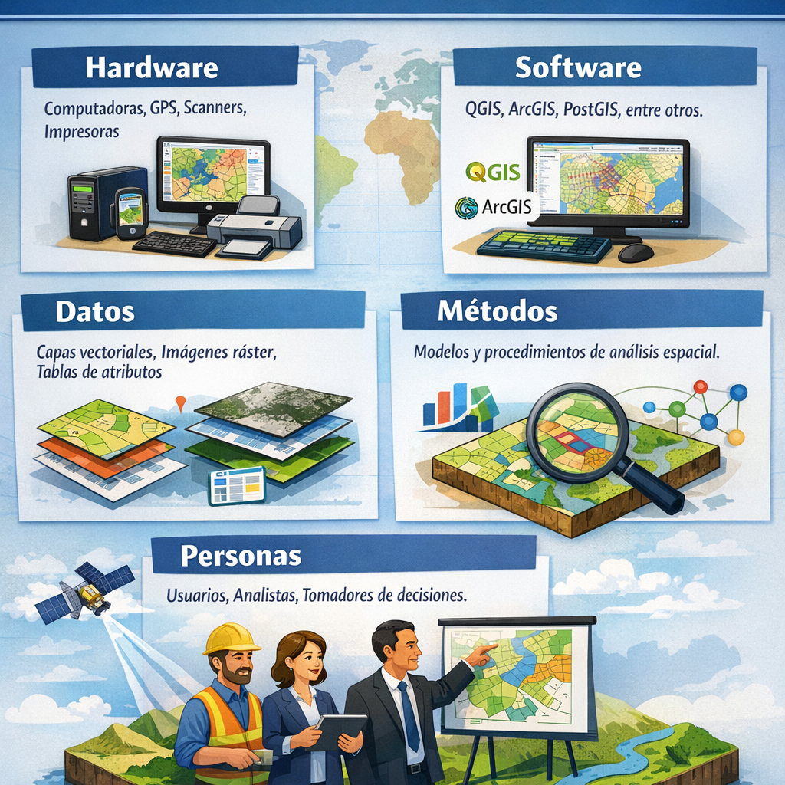
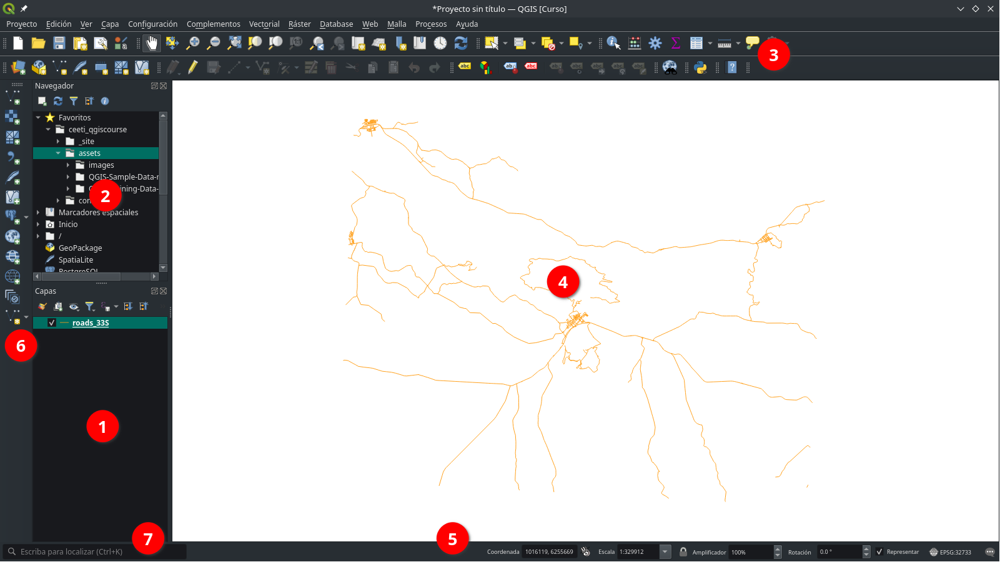
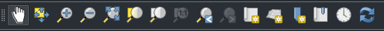
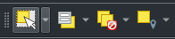
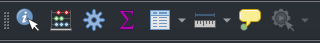
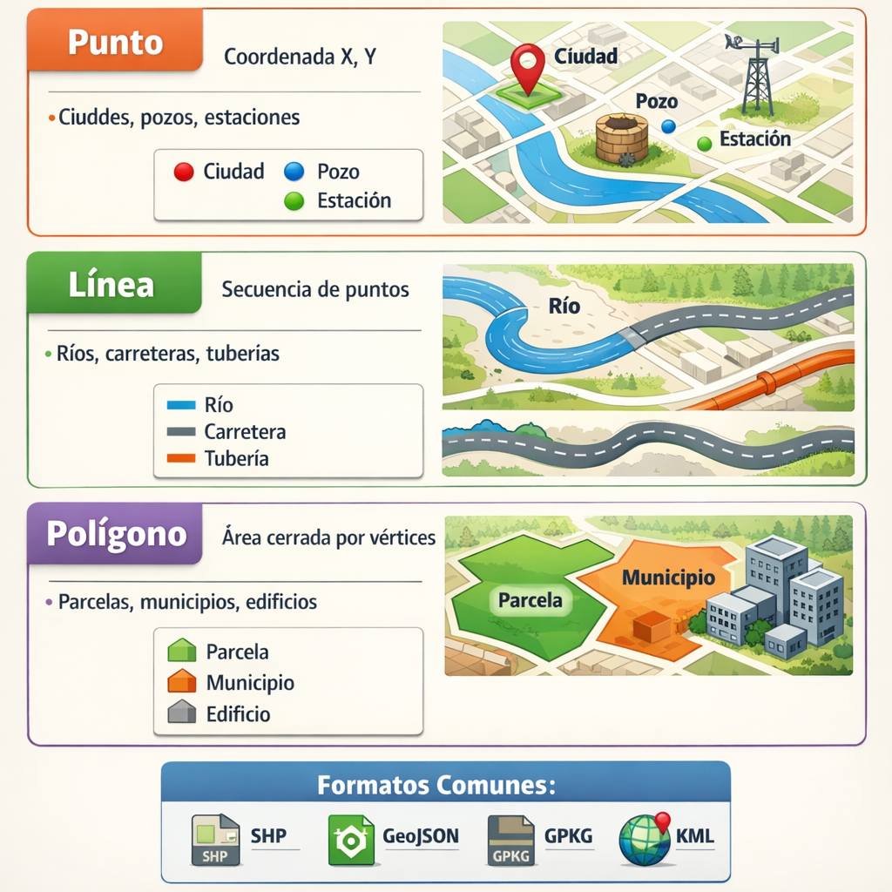
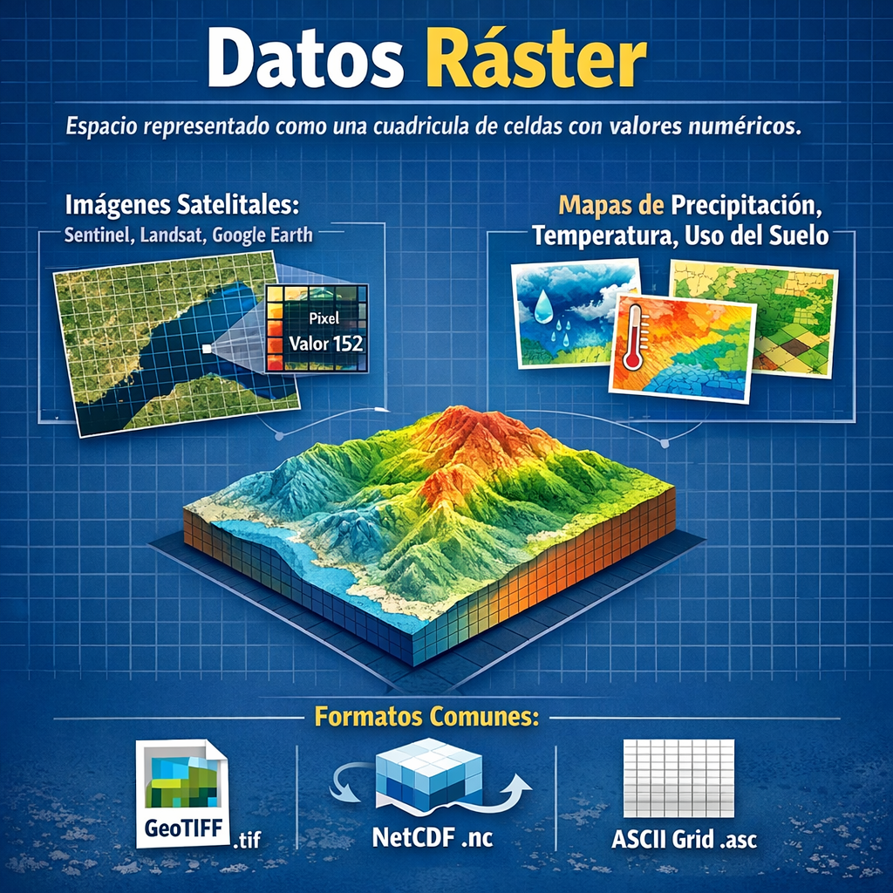

## Objetivos del Módulo

Al finalizar este módulo, los participantes podrán:

- Explicar qué es un Sistema de Información Geográfica (SIG) y sus aplicaciones prácticas.
- Identificar las ventajas de QGIS frente a otras plataformas SIG.
- Navegar con fluidez por la interfaz de QGIS.
- Distinguir entre datos vectoriales y ráster.

---

## 1.1 ¿Qué es un SIG y para qué sirve?

Un **Sistema de Información Geográfica (SIG)** es un sistema informático diseñado para capturar, almacenar, manipular, analizar, gestionar y presentar datos espaciales o geográficos.

### Componentes de un SIG

| Componente      | Descripción                                                   |
|:----------------|:--------------------------------------------------------------|
| **Hardware**    | Computadoras, GPS, scanners, impresoras                       |
| **Software**    | QGIS, ArcGIS, PostGIS, entre otros                            |
| **Datos**       | Capas vectoriales, imágenes ráster, tablas de atributos       |
| **Métodos**     | Modelos y procedimientos de análisis espacial                 |
| **Personas**    | Usuarios, analistas y tomadores de decisiones                 |

### Aplicaciones prácticas

Los SIG se utilizan en una amplia variedad de campos:

- 🏙️ **Planificación urbana**: diseño de infraestructuras y servicios
- 🌿 **Medio ambiente**: monitoreo de recursos naturales y cambio climático
- 🚛 **Logística y transporte**: optimización de rutas y flotas
- 🏥 **Salud pública**: análisis epidemiológico y cobertura de servicios
- 🌾 **Agricultura**: gestión de cultivos y análisis de suelos
- 🔒 **Seguridad**: análisis de incidentes y cobertura policial

---

## 1.2 Ventajas de QGIS como plataforma de código abierto

**QGIS** (anteriormente Quantum GIS) es la plataforma SIG de escritorio de código abierto más utilizada en el mundo.

::: {.callout-tip}
## ¿Por qué elegir QGIS?

- **Gratuito y de código abierto**: sin costos de licencia
- **Multiplataforma**: disponible para Windows, macOS, Linux y Android
- **Comunidad activa**: miles de contribuidores y usuarios en todo el mundo
- **Extensible**: más de 1,000 plugins disponibles
- **Estándares abiertos**: compatibilidad con formatos OGC (WMS, WFS, WCS)
- **Integración con Python**: automatización mediante PyQGIS
:::

### Comparativa entre QGIS y ArcGIS

| Característica         | QGIS         | ArcGIS      |
|:-----------------------|:-------------|:------------|
| Costo                  | Gratuito     | De pago     |
| Código abierto         | ✅           |    ❌       |
| Plataformas            | Win/Mac/Linux| Windows     |
| Extensibilidad         | Alta         | Alta        |
| Comunidad              | Muy activa   | Activa      |
| Integración Python     | Nativa       | Nativa      |

---

## 1.3 Interfaz de QGIS: paneles, capas, consola, herramientas

### Pantalla principal de QGIS

La interfaz de QGIS está compuesta por los siguientes elementos principales:

{.lightbox}

### Paneles principales

1. **Panel de Capas (Layers Panel)**: gestión y orden de las capas del proyecto
2. **Panel del Explorador**: navegación de archivos y fuentes de datos
3. **Barra de Herramientas**: acceso rápido a funciones comunes
4. **Vista del Mapa (Map Canvas)**: área de visualización geoespacial
5. **Barra de Estado**: información sobre la escala, coordenadas y sistema de referencia de coordenadas (CRS)
6. **Barra de Herramientas Lateral**: contiene botones para cargar capas y crear nuevas capas
7. **Barra de Localización**: herramienta de búsqueda rápida para acceder a capas, entidades, algoritmos, marcadores espaciales y otros objetos de QGIS desde un único lugar.

### Herramientas esenciales

::: {.grid}

::: {.g-col-12 .g-col-md-6}
{.lightbox}  
**Herramientas de navegación de mapas**: zoom, desplazamiento, extensión completa, zoom a la capa, etc.
:::

::: {.g-col-12 .g-col-md-6}
{.lightbox}  
**Herramientas de selección**: seleccionar entidades por área, atributo o localización.
:::

::: {.g-col-12 .g-col-md-6}
{.lightbox}  
**Herramientas de atributos**: consultar atributos de entidades, medir distancias, áreas y perímetros
:::

::: {.g-col-12 .g-col-md-6}
{.lightbox}  
**Herramientas de digitalización**: crear y editar geometrías
:::

:::

::: {.callout-note}
## Acceso rápido a herramientas

Puedes activar o desactivar paneles desde el menú **Configuración → Paneles** y las barras de herramientas desde **Configuración → Barras de herramientas**.
:::

---

## 1.4 Tipos de datos espaciales: vectoriales vs ráster

### Datos vectoriales

Los **datos vectoriales** representan objetos geográficos mediante geometrías definidas matemáticamente:

### Datos ráster

Los **datos ráster** representan el espacio como una cuadrícula regular de celdas (píxeles), donde cada celda tiene un valor numérico:

### ¿Cuándo usar cada tipo?

| Criterio              | Vectorial                                      | Ráster                                 |
|:----------------------|:-----------------------------------------------|:---------------------------------------|
| Objetos discretos     | ✅ Ideal                                        | ❌ Menos natural                        |
| Fenómenos continuos   | ❌ Más complejo                                 | ✅ Ideal                                |
| Edición de geometrías | ✅ Fácil                                        | ❌ Difícil                              |
| Cálculo de áreas      | ✅ Preciso para polígonos                       | ✅ Posible según resolución             |
| Análisis de terreno   | ✅ Posible con TIN/contornos, requiere modelado | ✅ Natural para DEM y derivados         |
| Tamaño de archivo     | Menor para objetos discretos                   | Mayor según resolución                 |

> Nota: en GIS, “superficie” puede referirse al cálculo de áreas de polígonos o al modelado de la superficie del terreno. El vector es ideal para calcular áreas y manejar geometrías discretas; el ráster es más natural para representar un DEM y derivar pendiente, aspecto, cuencas o volúmenes.

---

## 🛠️ Ejercicio Práctico

### Ejercicio 1.1: Exploración de la interfaz de QGIS

1. Abre QGIS en tu computadora.
2. Familiarízate con los paneles y herramientas principales.
3. Activa/Desactiva el panel del **Explorador** (Configuración → Paneles → Explorador).
4. Activa/Desactiva la barra de herramientas de **Atributos** (Configuración → Barras de herramientas → Atributos).
5. Localiza la **Consola de Python** en el menú **Complementos → Consola de Python** y ábrela para verificar que PyQGIS está disponible.

### Ejercicio 1.2: Identificar tipos de datos

1. Descarga el dataset de ejemplo desde la [página de QGIS](https://github.com/qgis/QGIS-Training-Data/archive/release_3.44.zip).
2. Carga capas de los tres tipos (punto, línea, polígono).
3. Examina la tabla de atributos de cada capa (clic derecho → Abrir tabla de atributos).
4. Identifica el sistema de referencia de coordenadas (CRS) de cada capa.

---

## 📚 Recursos y Referencias

- [Documentación oficial de QGIS en español](https://docs.qgis.org/latest/es/)
- [QGIS Training Manual](https://docs.qgis.org/latest/es/docs/training_manual/)
- [Página de descarga de QGIS](https://qgis.org/download/)

---

::: {.callout-important}
## Para la próxima sesión

Asegúrate de tener QGIS instalado y funcionando correctamente antes de la sesión 2.

- Revisa la documentación oficial de QGIS:
  - [docs.qgis.org/latest/es/](https://docs.qgis.org/latest/es/)
- Si tienes dudas o sugerencias sobre el curso, siéntete libre de publicar un issue en el repositorio del curso:
  - [github.com/lalgonzales/ceeti_qgiscourse/issues](https://github.com/lalgonzales/ceeti_qgiscourse/issues)
- También puedes usar las GitHub Discussions del repo para preguntas, ideas de mejora o comentarios generales:
  - [github.com/lalgonzales/ceeti_qgiscourse/discussions](https://github.com/lalgonzales/ceeti_qgiscourse/discussions)

:::
