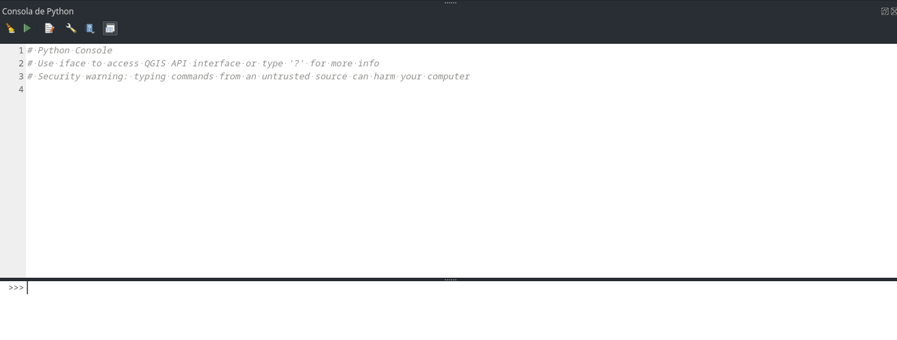

## Objetivos del Módulo

Al finalizar este módulo, los participantes podrán:

- **Comprender** qué es Python y por qué automatizar tareas en QGIS
- **Usar** la consola de Python integrada en QGIS con confianza
- **Leer y manipular** información de capas y atributos usando PyQGIS
- **Crear scripts simples** para automatizar tareas repetitivas del sector eléctrico
- **Exportar resultados** automáticamente a Excel, PDF y otros formatos
- **Aplicar** el Processing Framework para crear flujos de trabajo personalizados

---

## 🤔 ¿Por qué automatizar tareas en QGIS?

### El problema diario en empresas eléctricas

Imagina que trabajas en una empresa eléctrica y cada semana debes:

- ✅ Generar reportes de cobertura de 50 subestaciones
- ✅ Calcular áreas de servicio para 200 transformadores
- ✅ Exportar mapas de rutas de mantenimiento a PDF
- ✅ Actualizar distancias entre puntos críticos
- ✅ Crear buffers de seguridad alrededor de líneas de alta tensión

**¿Cuánto tiempo te toma hacer esto manualmente?** 🕐

### La solución: Python + PyQGIS

**Python** es como tener un **asistente digital** que:

- Nunca se cansa 🤖
- No comete errores de cálculo 🎯
- Trabaja 24/7 si es necesario ⏰
- Repite tareas perfectamente 🔄
- Documenta todo lo que hace 📝

**PyQGIS** es el "idioma" que Python usa para "hablar" con QGIS.

::: {.callout-tip}
## Analogía práctica
Si QGIS fuera un automóvil, Python sería el piloto automático que puede manejar rutas complejas sin intervención humana.
:::

### Casos de éxito en el sector eléctrico

| Tarea manual (antes) | Tiempo | Automatizada (después) | Tiempo |
|:---------------------|:-------|:-----------------------|:-------|
| Calcular cobertura de 50 subestaciones | 4 horas | Script automático | 5 minutos |
| Generar 20 mapas de rutas | 2 horas | Exportación masiva | 30 segundos |
| Actualizar distancias en 500 puntos | 6 horas | Cálculo automático | 2 minutos |

---

## 🐍 Introducción a Python en QGIS

### ¿Qué es Python?

Python es un **lenguaje de programación** diseñado para ser:

- **Fácil de leer**: Se parece al inglés
- **Poderoso**: Puede hacer cálculos complejos
- **Versátil**: Funciona con mapas, datos, internet, etc.

### Acceso a la consola de Python

La consola de Python está integrada en QGIS:

```
Menú: Complementos → Consola de Python
Atajo: Ctrl+Alt+P (Windows/Linux) o Cmd+Alt+P (Mac)
```

### Interfaz de la consola



La consola tiene **dos áreas principales**:

1. **Área de comandos** (abajo): Escribes y ejecutas código línea por línea
2. **Editor de scripts** (arriba): Escribes programas completos

::: {.callout-note}
## Activar el editor
Haz clic en "Mostrar editor" para ver ambas áreas. El editor te permite escribir scripts más largos y guardarlos.
:::

### Primeros comandos básicos

Vamos a empezar con lo más simple:

```python
# Esto es un comentario - Python lo ignora
# Los comentarios nos ayudan a explicar qué hace el código

# Imprimir texto en pantalla
print("¡Hola desde QGIS!")

# Hacer cálculos simples
print(2 + 3)
print(10 * 5)

# Crear variables (como cajas que guardan información)
nombre_empresa = "Empresa Eléctrica Nacional"
numero_subestaciones = 25
print(f"La {nombre_empresa} tiene {numero_subestaciones} subestaciones")
```

**¡Prueba estos comandos en tu consola!**

---

## 🗺️ Entendiendo PyQGIS: La conexión con QGIS

### ¿Qué es PyQGIS?

**PyQGIS** es una biblioteca que permite a Python "hablar" con QGIS. Es como un traductor entre Python y QGIS.

### Conceptos clave de PyQGIS

Piensa en PyQGIS como una **jerarquía de objetos**:

```
🏢 QgsProject (El proyecto completo)
  └── 📁 QgsVectorLayer (Una capa de datos)
      └── 📄 QgsFeature (Una fila/entidad)
          ├── 🔷 QgsGeometry (La forma geográfica)
          └── 📊 Attributes (Los datos de la tabla)
```

### Objetos principales explicados

| Objeto PyQGIS | ¿Qué es? | Analogía |
|:--------------|:---------|:---------|
| `QgsProject` | Todo tu proyecto QGIS | El edificio completo |
| `QgsVectorLayer` | Una capa (subestaciones, líneas, etc.) | Una oficina en el edificio |
| `QgsFeature` | Una entidad específica (una subestación) | Una persona en la oficina |
| `QgsGeometry` | La ubicación/forma geográfica | La dirección de la persona |
| `QgsField` | Una columna de datos | Una característica de la persona |

### Primeros pasos con PyQGIS

```python
# Importar las herramientas de PyQGIS
from qgis.core import *
from qgis.gui import *

# Acceder al proyecto actual
proyecto = QgsProject.instance()
print(f"Proyecto actual: {proyecto.fileName()}")

# Ver todas las capas del proyecto
capas = proyecto.mapLayers()
print(f"Número de capas: {len(capas)}")

# Listar nombres de las capas
for id_capa, capa in capas.items():
    entidades = capa.featureCount() if capa.type() == QgsMapLayer.VectorLayer else "N/A"
    print(f"- {capa.name()} ({entidades} entidades)")
```

---

## 📊 Trabajando con capas y datos

### Obtener información básica de una capa

```python
# Obtener la capa activa (la que está seleccionada)
capa_activa = iface.activeLayer()

if capa_activa:
    print(f"Capa seleccionada: {capa_activa.name()}")
    print(f"Tipo de geometría: {capa_activa.geometryType().name}")
    print(f"Número de entidades: {capa_activa.featureCount()}")
    print(f"Sistema de coordenadas: {capa_activa.crs().authid()}")
else:
    print("No hay ninguna capa seleccionada")
```

### Leer los campos (columnas) de una capa

```python
capa = iface.activeLayer()

print("Campos disponibles:")
for campo in capa.fields():
    tipo = campo.typeName()
    print(f"- {campo.name()} ({tipo})")
```

### Ejemplo práctico: Información de subestaciones

Supongamos que tienes una capa de subestaciones eléctricas:

```python
# Buscar la capa de subestaciones por nombre
capas_proyecto = QgsProject.instance().mapLayersByName("Subestaciones")

if capas_proyecto:
    subestaciones = capas_proyecto[0]  # Tomar la primera capa encontrada

    print(f"=== INFORMACIÓN DE SUBESTACIONES ===")
    print(f"Total de subestaciones: {subestaciones.featureCount()}")

    # Mostrar información de cada subestación
    for subestacion in subestaciones.getFeatures():
        nombre = subestacion["nombre"]  # Asumiendo que hay un campo "nombre"
        voltaje = subestacion["voltaje"]  # Asumiendo que hay un campo "voltaje"
        print(f"- {nombre}: {voltaje} kV")

        # Solo mostrar las primeras 5 para no saturar la consola
        if subestacion.id() >= 5:
            print("... (y más)")
            break
else:
    print("No se encontró la capa 'Subestaciones'")
```

---

## 🔧 Scripts de automatización para empresas eléctricas

### Script 1: Calcular distancias entre subestaciones

```python
from qgis.core import QgsDistanceArea, QgsUnitTypes

def calcular_distancias_subestaciones():
    """
    Calcula la distancia entre todas las subestaciones
    y encuentra la más cercana a cada una.
    """
    # Buscar la capa de subestaciones
    capas = QgsProject.instance().mapLayersByName("Subestaciones")
    if not capas:
        print("❌ No se encontró la capa 'Subestaciones'")
        return

    subestaciones = capas[0]

    # Herramienta para calcular distancias
    calculadora = QgsDistanceArea()
    calculadora.setSourceCrs(subestaciones.crs(), QgsProject.instance().transformContext())

    print("=== ANÁLISIS DE DISTANCIAS ENTRE SUBESTACIONES ===")

    # Obtener todas las subestaciones como lista
    lista_subestaciones = list(subestaciones.getFeatures())

    for subestacion_a in lista_subestaciones:
        nombre_a = subestacion_a["nombre"]
        punto_a = subestacion_a.geometry().asPoint()

        distancia_minima = float('inf')
        subestacion_mas_cercana = None

        # Comparar con todas las demás subestaciones
        for subestacion_b in lista_subestaciones:
            if subestacion_a.id() == subestacion_b.id():
                continue  # Saltar la misma subestación

            punto_b = subestacion_b.geometry().asPoint()
            distancia = calculadora.measureLine(punto_a, punto_b)

            if distancia < distancia_minima:
                distancia_minima = distancia
                subestacion_mas_cercana = subestacion_b["nombre"]

        # Convertir metros a kilómetros
        distancia_km = distancia_minima / 1000
        print(f"🔌 {nombre_a} → más cercana: {subestacion_mas_cercana} ({distancia_km:.2f} km)")

# Ejecutar la función
calcular_distancias_subestaciones()
```

### Script 2: Generar buffers de seguridad automáticamente

```python
def crear_zonas_seguridad_lineas():
    """
    Crea zonas de seguridad alrededor de líneas de alta tensión
    con diferentes distancias según el voltaje.
    """
    # Buscar la capa de líneas de transmisión
    capas = QgsProject.instance().mapLayersByName("Lineas_Transmision")
    if not capas:
        print("❌ No se encontró la capa 'Lineas_Transmision'")
        return

    lineas = capas[0]

    # Definir distancias de seguridad según voltaje
    distancias_seguridad = {
        "138": 50,   # 138 kV → 50 metros
        "230": 75,   # 230 kV → 75 metros
        "500": 150   # 500 kV → 150 metros
    }

    print("=== CREANDO ZONAS DE SEGURIDAD ===")

    for voltaje, distancia in distancias_seguridad.items():
        # Crear nueva capa para este voltaje
        crs = lineas.crs().authid()
        capa_buffer = QgsVectorLayer(
            f"Polygon?crs={crs}",
            f"Zona_Seguridad_{voltaje}kV",
            "memory"
        )

        # Configurar campos de la nueva capa
        provider = capa_buffer.dataProvider()
        provider.addAttributes([
            QgsField("voltaje", QVariant.String),
            QgsField("distancia_m", QVariant.Int),
            QgsField("nombre_linea", QVariant.String)
        ])
        capa_buffer.updateFields()

        # Filtrar líneas por voltaje y crear buffers
        entidades_buffer = []
        for linea in lineas.getFeatures():
            voltaje_linea = str(linea["voltaje"])

            if voltaje_linea == voltaje:
                # Crear buffer
                geometria_buffer = linea.geometry().buffer(distancia, 8)

                # Crear nueva entidad
                nueva_entidad = QgsFeature()
                nueva_entidad.setGeometry(geometria_buffer)
                nueva_entidad.setAttributes([
                    f"{voltaje} kV",
                    distancia,
                    linea["nombre"]
                ])
                entidades_buffer.append(nueva_entidad)

        # Agregar entidades a la capa
        provider.addFeatures(entidades_buffer)

        # Agregar capa al proyecto
        QgsProject.instance().addMapLayer(capa_buffer)

        print(f"✅ Zona de seguridad {voltaje} kV creada: {len(entidades_buffer)} buffers de {distancia}m")

# Ejecutar la función
crear_zonas_seguridad_lineas()
```

### Script 3: Exportar reportes automáticamente

```python
import csv
from datetime import datetime
import os

def generar_reporte_subestaciones():
    """
    Genera un reporte CSV con información detallada de todas las subestaciones.
    """
    # Buscar la capa de subestaciones
    capas = QgsProject.instance().mapLayersByName("Subestaciones")
    if not capas:
        print("❌ No se encontró la capa 'Subestaciones'")
        return

    subestaciones = capas[0]

    # Crear nombre de archivo con fecha
    fecha_actual = datetime.now().strftime("%Y%m%d_%H%M")
    nombre_archivo = f"reporte_subestaciones_{fecha_actual}.csv"
    ruta_archivo = os.path.join(os.path.expanduser("~"), "Desktop", nombre_archivo)

    print(f"=== GENERANDO REPORTE DE SUBESTACIONES ===")

    # Crear archivo CSV
    with open(ruta_archivo, 'w', newline='', encoding='utf-8') as archivo:
        # Obtener nombres de campos
        campos = [campo.name() for campo in subestaciones.fields()]
        campos.extend(["coordenada_x", "coordenada_y", "area_cobertura_km2"])

        writer = csv.writer(archivo)
        writer.writerow(campos)  # Escribir encabezados

        # Escribir datos de cada subestación
        for subestacion in subestaciones.getFeatures():
            # Datos básicos de atributos
            fila = subestacion.attributes()

            # Agregar coordenadas
            punto = subestacion.geometry().asPoint()
            fila.extend([punto.x(), punto.y()])

            # Calcular área de cobertura (buffer de 5 km)
            buffer_cobertura = subestacion.geometry().buffer(5000, 8)  # 5000 metros
            area_m2 = buffer_cobertura.area()
            area_km2 = area_m2 / 1_000_000  # Convertir a km²
            fila.append(round(area_km2, 2))

            writer.writerow(fila)

    print(f"✅ Reporte generado exitosamente:")
    print(f"📁 Ubicación: {ruta_archivo}")
    print(f"📊 Total de subestaciones: {subestaciones.featureCount()}")

# Ejecutar la función
generar_reporte_subestaciones()
```

---

## 📤 Exportación automatizada de resultados

### Exportar capas a diferentes formatos

```python
def exportar_capa_multiple_formatos(nombre_capa):
    """
    Exporta una capa a múltiples formatos útiles para empresas eléctricas.
    """
    # Buscar la capa
    capas = QgsProject.instance().mapLayersByName(nombre_capa)
    if not capas:
        print(f"❌ No se encontró la capa '{nombre_capa}'")
        return

    capa = capas[0]

    # Definir formatos de exportación
    formatos = {
        "GeoJSON": "GeoJSON",
        "Shapefile": "ESRI Shapefile",
        "Excel": "XLSX",
        "KML": "KML"
    }

    print(f"=== EXPORTANDO '{nombre_capa}' A MÚLTIPLES FORMATOS ===")

    # Crear carpeta de exportación
    carpeta_exportacion = os.path.join(os.path.expanduser("~"), "Desktop", "exportaciones_qgis")
    os.makedirs(carpeta_exportacion, exist_ok=True)

    for nombre_formato, driver in formatos.items():
        # Definir extensión de archivo
        extensiones = {
            "GeoJSON": ".geojson",
            "Shapefile": ".shp",
            "Excel": ".xlsx",
            "KML": ".kml"
        }

        extension = extensiones[nombre_formato]
        ruta_salida = os.path.join(carpeta_exportacion, f"{nombre_capa}{extension}")

        # Configurar opciones de exportación
        opciones = QgsVectorFileWriter.SaveVectorOptions()
        opciones.driverName = driver
        opciones.fileEncoding = "UTF-8"

        # Exportar
        error, mensaje, _, _ = QgsVectorFileWriter.writeAsVectorFormatV3(
            capa,
            ruta_salida,
            QgsCoordinateTransformContext(),
            opciones
        )

        if error == QgsVectorFileWriter.NoError:
            print(f"✅ {nombre_formato}: {ruta_salida}")
        else:
            print(f"❌ Error en {nombre_formato}: {mensaje}")

    print(f"\n📁 Todos los archivos guardados en: {carpeta_exportacion}")

# Ejemplo de uso
exportar_capa_multiple_formatos("Subestaciones")
```

### Exportar mapas como imágenes

```python
def exportar_mapa_actual():
    """
    Exporta el mapa actual como imagen PNG de alta calidad.
    """
    from qgis.core import QgsMapSettings, QgsMapRendererParallelJob
    from PyQt5.QtCore import QSize
    from PyQt5.QtGui import QColor

    # Configurar el mapa
    configuracion = QgsMapSettings()
    configuracion.setLayers([layer for layer in QgsProject.instance().mapLayers().values()])
    configuracion.setBackgroundColor(QColor(255, 255, 255))  # Fondo blanco
    configuracion.setOutputSize(QSize(1920, 1080))  # Resolución Full HD
    configuracion.setExtent(iface.mapCanvas().extent())
    configuracion.setDestinationCrs(QgsProject.instance().crs())

    # Renderizar el mapa
    trabajo_render = QgsMapRendererParallelJob(configuracion)
    trabajo_render.start()
    trabajo_render.waitForFinished()

    # Guardar imagen
    imagen = trabajo_render.renderedImage()
    fecha_actual = datetime.now().strftime("%Y%m%d_%H%M")
    nombre_archivo = f"mapa_electrico_{fecha_actual}.png"
    ruta_archivo = os.path.join(os.path.expanduser("~"), "Desktop", nombre_archivo)

    if imagen.save(ruta_archivo):
        print(f"✅ Mapa exportado exitosamente:")
        print(f"📁 {ruta_archivo}")
        print(f"📐 Resolución: {imagen.width()}x{imagen.height()}")
    else:
        print("❌ Error al guardar la imagen")

# Ejecutar la función
exportar_mapa_actual()
```

---

## ⚙️ QGIS Processing Framework

### ¿Qué es el Processing Framework?

El **Processing Framework** es como una "caja de herramientas automatizada" que contiene cientos de algoritmos listos para usar desde Python.

### Usar herramientas de processing desde Python

```python
import processing

# Ver todas las herramientas disponibles (¡son muchas!)
# for algoritmo in QgsApplication.processingRegistry().algorithms():
#     print(f"{algoritmo.id()} — {algoritmo.displayName()}")

# Ejemplo 1: Crear buffer automáticamente
def crear_buffer_processing(nombre_capa, distancia_metros):
    """
    Crea un buffer usando el Processing Framework.
    """
    capas = QgsProject.instance().mapLayersByName(nombre_capa)
    if not capas:
        print(f"❌ Capa '{nombre_capa}' no encontrada")
        return

    capa_origen = capas[0]

    # Ejecutar algoritmo de buffer
    resultado = processing.run("native:buffer", {
        'INPUT': capa_origen,
        'DISTANCE': distancia_metros,
        'SEGMENTS': 8,
        'END_CAP_STYLE': 0,  # Redondo
        'JOIN_STYLE': 0,     # Redondo
        'MITER_LIMIT': 2,
        'DISSOLVE': False,
        'OUTPUT': 'TEMPORARY_OUTPUT'
    })

    # Agregar resultado al proyecto
    capa_buffer = resultado['OUTPUT']
    capa_buffer.setName(f"Buffer_{nombre_capa}_{distancia_metros}m")
    QgsProject.instance().addMapLayer(capa_buffer)

    print(f"✅ Buffer creado: {distancia_metros}m alrededor de '{nombre_capa}'")
    return capa_buffer

# Ejemplo de uso
crear_buffer_processing("Subestaciones", 1000)  # Buffer de 1 km
```

### Flujo de trabajo automatizado completo

```python
def flujo_analisis_electrico_completo():
    """
    Flujo completo de análisis para empresa eléctrica:
    1. Crear zonas de cobertura de subestaciones
    2. Identificar áreas sin cobertura
    3. Calcular estadísticas
    4. Exportar resultados
    """
    print("🔄 INICIANDO ANÁLISIS ELÉCTRICO AUTOMATIZADO")
    print("=" * 50)

    # Paso 1: Verificar capas necesarias
    capas_necesarias = ["Subestaciones", "Municipios"]
    for nombre_capa in capas_necesarias:
        if not QgsProject.instance().mapLayersByName(nombre_capa):
            print(f"❌ Falta la capa: {nombre_capa}")
            return

    subestaciones = QgsProject.instance().mapLayersByName("Subestaciones")[0]
    municipios = QgsProject.instance().mapLayersByName("Municipios")[0]

    # Paso 2: Crear zonas de cobertura (buffer de 10 km)
    print("📍 Creando zonas de cobertura...")
    cobertura = processing.run("native:buffer", {
        'INPUT': subestaciones,
        'DISTANCE': 10000,  # 10 km
        'SEGMENTS': 16,
        'DISSOLVE': True,   # Unir buffers superpuestos
        'OUTPUT': 'TEMPORARY_OUTPUT'
    })['OUTPUT']

    cobertura.setName("Cobertura_Electrica_10km")
    QgsProject.instance().addMapLayer(cobertura)

    # Paso 3: Identificar áreas sin cobertura
    print("🔍 Identificando áreas sin cobertura...")
    sin_cobertura = processing.run("native:difference", {
        'INPUT': municipios,
        'OVERLAY': cobertura,
        'OUTPUT': 'TEMPORARY_OUTPUT'
    })['OUTPUT']

    sin_cobertura.setName("Areas_Sin_Cobertura")
    QgsProject.instance().addMapLayer(sin_cobertura)

    # Paso 4: Calcular estadísticas
    print("📊 Calculando estadísticas...")

    # Área total de municipios
    area_total = sum(municipio.geometry().area() for municipio in municipios.getFeatures())
    area_total_km2 = area_total / 1_000_000

    # Área sin cobertura
    area_sin_cobertura = sum(area.geometry().area() for area in sin_cobertura.getFeatures())
    area_sin_cobertura_km2 = area_sin_cobertura / 1_000_000

    # Porcentaje de cobertura
    porcentaje_cobertura = ((area_total_km2 - area_sin_cobertura_km2) / area_total_km2) * 100

    # Paso 5: Mostrar resultados
    print("\n📈 RESULTADOS DEL ANÁLISIS:")
    print(f"🏢 Total de subestaciones: {subestaciones.featureCount()}")
    print(f"🗺️  Área total analizada: {area_total_km2:.2f} km²")
    print(f"✅ Área con cobertura: {(area_total_km2 - area_sin_cobertura_km2):.2f} km²")
    print(f"❌ Área sin cobertura: {area_sin_cobertura_km2:.2f} km²")
    print(f"📊 Porcentaje de cobertura: {porcentaje_cobertura:.1f}%")

    # Paso 6: Exportar reporte
    print("\n💾 Exportando reporte...")
    fecha = datetime.now().strftime("%Y%m%d_%H%M")
    ruta_reporte = os.path.join(os.path.expanduser("~"), "Desktop", f"analisis_cobertura_{fecha}.txt")

    with open(ruta_reporte, 'w', encoding='utf-8') as archivo:
        archivo.write("REPORTE DE ANÁLISIS DE COBERTURA ELÉCTRICA\n")
        archivo.write("=" * 50 + "\n\n")
        archivo.write(f"Fecha del análisis: {datetime.now().strftime('%d/%m/%Y %H:%M')}\n")
        archivo.write(f"Total de subestaciones: {subestaciones.featureCount()}\n")
        archivo.write(f"Área total analizada: {area_total_km2:.2f} km²\n")
        archivo.write(f"Área con cobertura: {(area_total_km2 - area_sin_cobertura_km2):.2f} km²\n")
        archivo.write(f"Área sin cobertura: {area_sin_cobertura_km2:.2f} km²\n")
        archivo.write(f"Porcentaje de cobertura: {porcentaje_cobertura:.1f}%\n")

    print(f"✅ Análisis completado. Reporte guardado en: {ruta_reporte}")

# Ejecutar el flujo completo
flujo_analisis_electrico_completo()
```

---

## 🛠️ Ejercicios Prácticos

### Ejercicio 5.1: Primeros pasos (15 minutos)

**Objetivo**: Familiarizarse con la consola Python

1. Abre la consola de Python en QGIS
2. Ejecuta estos comandos uno por uno:

```python
# Saludo personalizado
print("¡Hola! Soy un analista de datos eléctricos")

# Cálculos básicos de potencia
voltaje = 230  # kV
corriente = 500  # A
potencia = voltaje * corriente
print(f"Potencia: {potencia} kW")

# Lista de subestaciones (simulada)
subestaciones = ["Central", "Norte", "Sur", "Este", "Oeste"]
print(f"Tenemos {len(subestaciones)} subestaciones:")
for i, nombre in enumerate(subestaciones, 1):
    print(f"{i}. {nombre}")
```

### Ejercicio 5.2: Información de capas (20 minutos)

**Objetivo**: Leer información básica de las capas del proyecto

1. Carga una capa de puntos (puede ser cualquier capa de puntos)
2. Ejecuta este script adaptándolo a tu capa:

```python
# Obtener información de la capa activa
capa = iface.activeLayer()

if capa:
    print(f"=== INFORMACIÓN DE LA CAPA ===")
    print(f"Nombre: {capa.name()}")
    print(f"Tipo: {capa.geometryType()}")
    print(f"Entidades: {capa.featureCount()}")
    print(f"CRS: {capa.crs().authid()}")

    print(f"\n=== CAMPOS DISPONIBLES ===")
    for campo in capa.fields():
        print(f"- {campo.name()} ({campo.typeName()})")

    print(f"\n=== PRIMERAS 3 ENTIDADES ===")
    for i, entidad in enumerate(capa.getFeatures()):
        if i >= 3:  # Solo mostrar las primeras 3
            break
        print(f"Entidad {i+1}: {entidad.attributes()}")
else:
    print("❌ No hay ninguna capa seleccionada")
```

### Ejercicio 5.3: Script de automatización (25 minutos)

**Objetivo**: Crear un script útil para análisis eléctrico

Crea un script que:
1. Calcule el área de cobertura de cada punto (buffer de 2 km)
2. Sume el área total de cobertura
3. Exporte los resultados a un archivo de texto

```python
def analizar_cobertura_puntos():
    """
    Analiza la cobertura de puntos con buffer de 2 km
    """
    capa = iface.activeLayer()

    if not capa:
        print("❌ Selecciona una capa de puntos primero")
        return

    print(f"🔍 Analizando cobertura de: {capa.name()}")

    area_total = 0
    contador = 0

    for punto in capa.getFeatures():
        # Crear buffer de 2 km
        buffer = punto.geometry().buffer(2000, 8)
        area_buffer = buffer.area()  # en metros cuadrados
        area_km2 = area_buffer / 1_000_000  # convertir a km²

        area_total += area_km2
        contador += 1

        # Mostrar información del punto
        nombre = punto.attributes()[0] if punto.attributes() else f"Punto_{contador}"
        print(f"📍 {nombre}: {area_km2:.2f} km² de cobertura")

    print(f"\n📊 RESUMEN:")
    print(f"Total de puntos: {contador}")
    print(f"Área total de cobertura: {area_total:.2f} km²")
    print(f"Área promedio por punto: {area_total/contador:.2f} km²")

    # Guardar resultados
    fecha = datetime.now().strftime("%Y%m%d_%H%M")
    archivo = os.path.join(os.path.expanduser("~"), "Desktop", f"analisis_cobertura_{fecha}.txt")

    with open(archivo, 'w', encoding='utf-8') as f:
        f.write(f"ANÁLISIS DE COBERTURA - {capa.name()}\n")
        f.write("=" * 40 + "\n")
        f.write(f"Fecha: {datetime.now().strftime('%d/%m/%Y %H:%M')}\n")
        f.write(f"Total de puntos: {contador}\n")
        f.write(f"Área total de cobertura: {area_total:.2f} km²\n")
        f.write(f"Área promedio por punto: {area_total/contador:.2f} km²\n")

    print(f"💾 Resultados guardados en: {archivo}")

# Ejecutar el análisis
analizar_cobertura_puntos()
```

### Ejercicio 5.4: Desafío avanzado (30 minutos)

**Objetivo**: Combinar múltiples técnicas

Crea un script que:
1. Identifique el punto más alejado del centro del mapa
2. Calcule la distancia desde ese punto a todos los demás
3. Cree una capa nueva con líneas conectando ese punto con los 3 más cercanos
4. Exporte todo a un reporte completo

---

## 📚 Recursos y Referencias

### Documentación oficial
- [PyQGIS Developer Cookbook](https://docs.qgis.org/latest/en/docs/pyqgis_developer_cookbook/) - Guía completa de PyQGIS
- [QGIS API Documentation](https://api.qgis.org/api/) - Referencia técnica completa
- [Python.org Tutorial](https://docs.python.org/3/tutorial/) - Tutorial oficial de Python

### Recursos específicos para empresas eléctricas
- [QGIS for Power System Analysis](https://www.qgis.org/en/site/about/case_studies/portugal_power.html) - Caso de estudio
- [Spatial Analysis for Utilities](https://www.esri.com/en-us/industries/electric-gas/overview) - Conceptos generales

### Comunidad y ayuda
- [QGIS Community](https://qgis.org/en/site/getinvolved/index.html) - Foros y grupos de usuarios
- [Stack Overflow - QGIS](https://stackoverflow.com/questions/tagged/qgis) - Preguntas y respuestas
- [GIS Stack Exchange](https://gis.stackexchange.com/questions/tagged/qgis) - Comunidad especializada

---

## 🎯 Puntos clave para recordar

::: {.callout-important}
## Conceptos fundamentales

1. **Python es tu asistente**: Automatiza tareas repetitivas y complejas
2. **PyQGIS es el traductor**: Permite que Python "hable" con QGIS
3. **Empieza simple**: Comandos básicos → scripts simples → automatización compleja
4. **Practica con datos reales**: Usa casos de tu empresa eléctrica
5. **Documenta tu código**: Los comentarios te ayudarán después
6. **Guarda tus scripts**: Reutiliza y mejora tus automatizaciones
:::

### Flujo de trabajo recomendado

```
1. 🎯 Identifica la tarea repetitiva
2. 🧪 Prueba comandos en la consola
3. 📝 Escribe el script en el editor
4. 🔄 Prueba con datos pequeños
5. ⚡ Ejecuta con datos completos
6. 💾 Guarda y documenta el script
7. 🔄 Reutiliza y mejora
```

¡Con estas herramientas podrás automatizar la mayoría de tareas repetitivas en tu trabajo con datos geoespaciales eléctricos! 🚀
